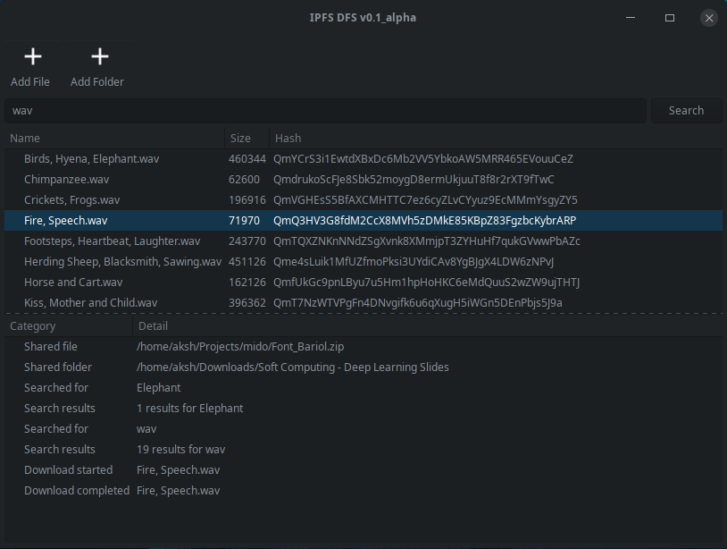

# IPFS-DFS
[](https://github.com/ambv/black)



IPFS-DFS is a file sharing client for the IPFS network. It is currently in an alpha stage at best. You have been warned.

## Running
```
pip install -r requirements.txt
ipfs daemon
python main.py
```

## Stack
- Python 3.7
- [py-ipfs-api](https://github.com/ipfs/py-ipfs-api)
- [Toga](https://pybee.org/toga/)

## TODO
- Better method for establishing connection.
- Fix imports.

## Contributors
- [aksh1618](https://github.com/aksh1618)
- [iamashank](https://github.com/iamashank)

## LICENSE

Copyright (C) 2018 Aakarshit Uppal, Ashank Anshuman

This program is free software: you can redistribute it and/or modify
it under the terms of the GNU General Public License as published by
the Free Software Foundation, either version 3 of the License, or
(at your option) any later version.

This program is distributed in the hope that it will be useful,
but WITHOUT ANY WARRANTY; without even the implied warranty of
MERCHANTABILITY or FITNESS FOR A PARTICULAR PURPOSE.  See the
GNU General Public License for more details.

You should have received a copy of the GNU General Public License
along with this program.  If not, see <https://www.gnu.org/licenses/>.

